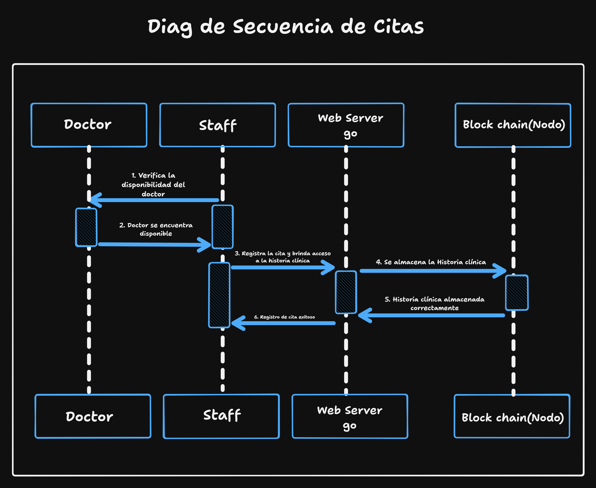
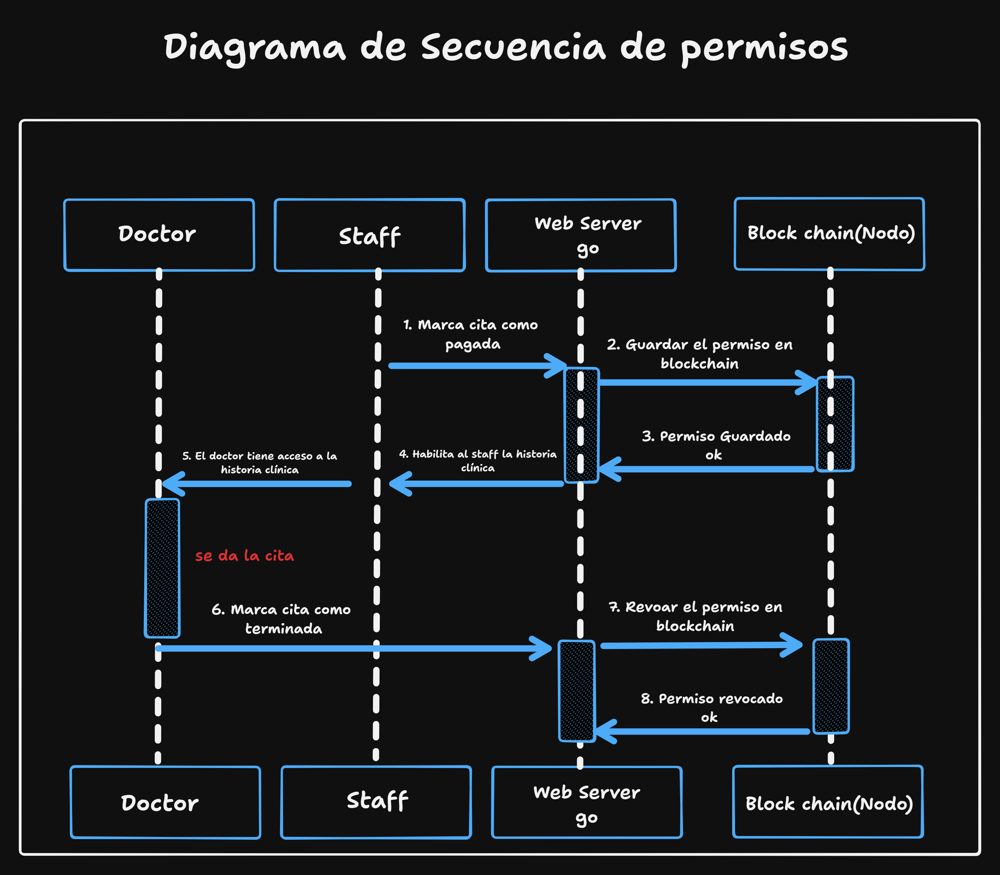
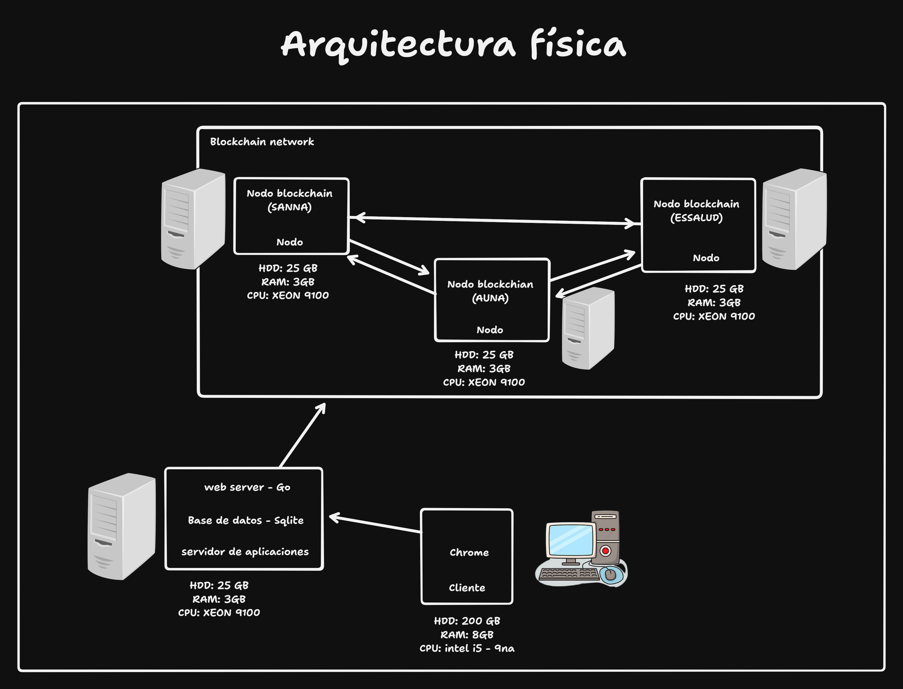
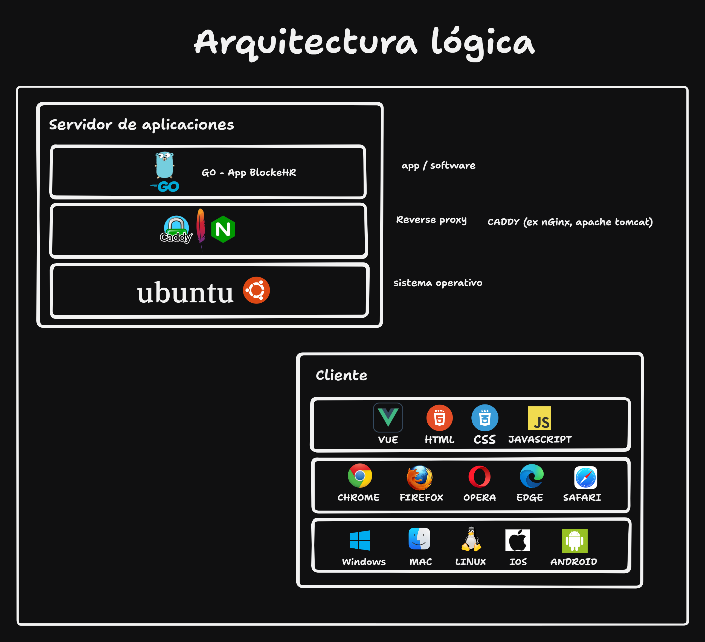
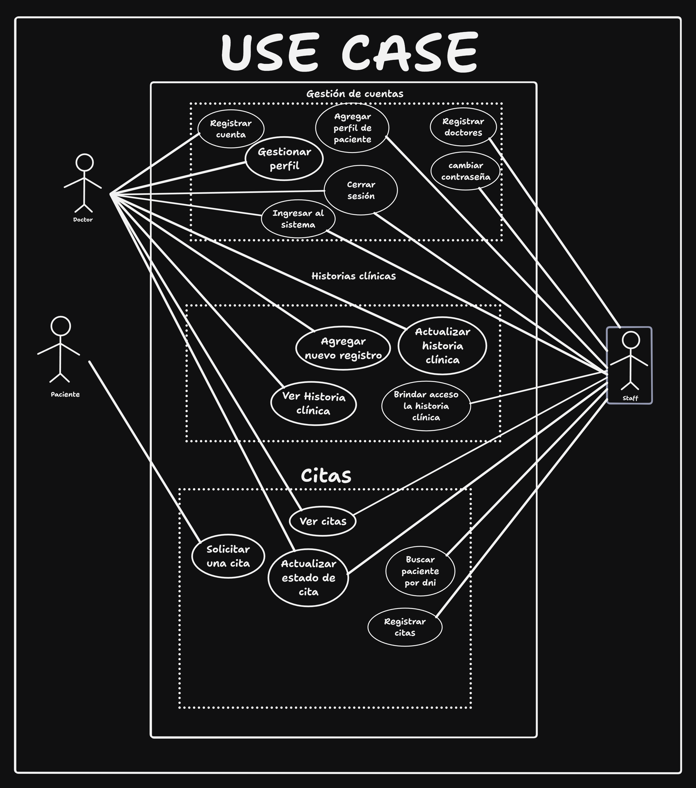
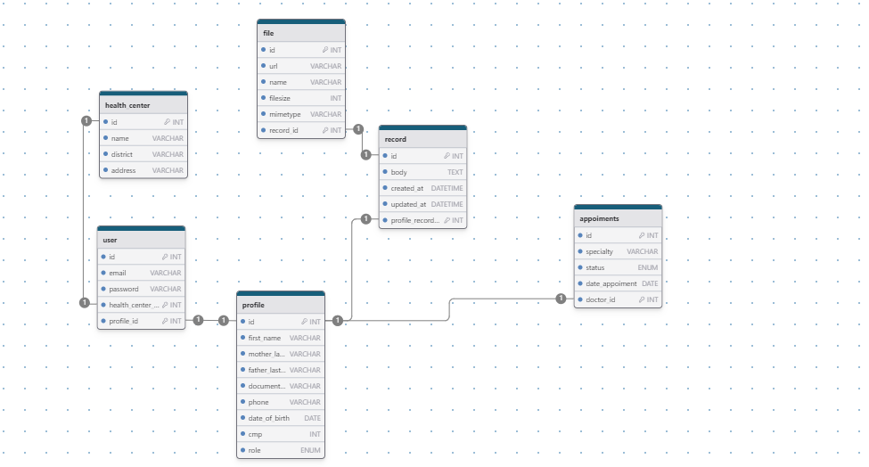
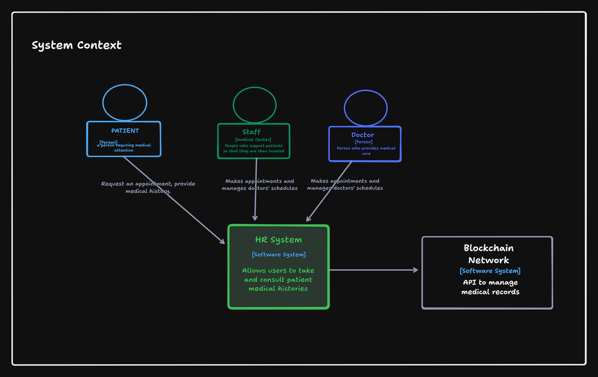
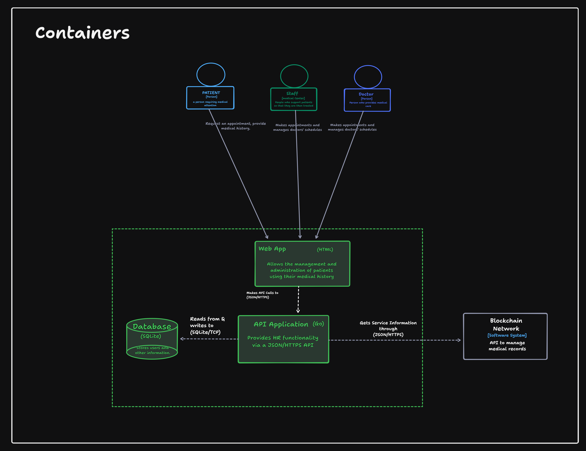
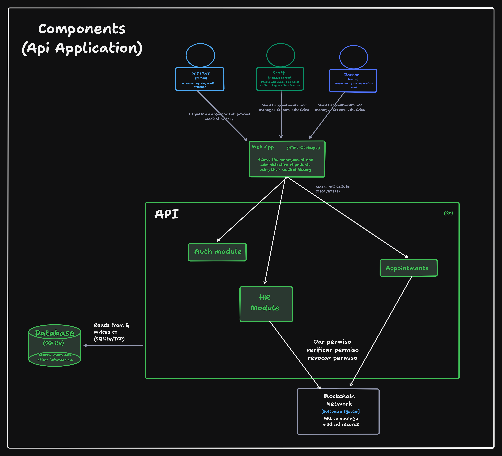

# HR Architecture
## Diagrama de secuencia de citas

  

El diagrama de secuencia de citas implica a 4 actores principales: el doctor, el personal (staff), el servidor web y la cadena de bloques (blockchain). El proceso comienza cuando el personal verifica la disponibilidad del doctor. Una vez confirmada la disponibilidad, el doctor procede a registrar una cita a través del servidor web. Finalmente, la historia clínica se almacena en la cadena de bloques.

## Diagrama de secuencia de permisos

  

El diagrama de secuencia de citas involucra a 4 actores principales: el personal (staff), el servidor web, la cadena de bloques (blockchain) y el doctor. El proceso comienza cuando el personal marca la cita como pagada en el servidor, y guarda el permiso de acceso al historial clínico en la cadena de bloques. Posteriormente, esta información se guarda y se envía de regreso al servidor web. Una vez que la web habilita al personal para acceder al historial clínico, este se envía al doctor para que pueda atender al paciente. Después de la atención médica, se crea un registro nuevo en el historial clínico y el permiso asignado se revoca en la cadena de bloques.

## Arquitectura física

  

En la arquitectura física, tanto el personal (staff) como el doctor utilizan sus navegadores web para acceder a la plataforma. Esta plataforma está respaldada por un servidor web que alberga una base de datos desarrollada en SQLite. Esta base de datos es capaz de almacenar información sobre doctores y pacientes. Además, la plataforma está conectada a una red blockchain, donde los nodos son representados por los centros médicos.

## Arquitectura lógica

  

​​
En la arquitectura lógica, el servidor de aplicaciones ejecutará el sistema operativo Ubuntu. Para el manejo del reverse proxy utilizaremos herramientas como Caddy, Apache y Nginx. En el desarrollo del software, se empleará el lenguaje Go.
Para los clientes, es decir, nuestros usuarios, podrán acceder a la plataforma utilizando cualquier sistema operativo y navegador. La plataforma estará desarrollada utilizando Vue.js, HTML, CSS y JavaScript.

## Caso de uso

  

En el caso de uso, se describen las funciones que realizan los usuarios dentro de la plataforma: Los doctores pueden crear cuentas, gestionar perfiles, agregar registros al historial clínico de los pacientes, ver historias clínicas, y actualizar estados de citas. El personal administrativo puede registrar doctores, cambiar contraseñas, agregar perfiles de pacientes, otorgar acceso a historias clínicas, buscar pacientes por DNI y gestionar estados de citas.

## ERD

  

En la base de datos, se encuentran varias tablas que incluyen "health_center" para almacenar datos de los centros de salud, "user" para los usuarios de la plataforma, "profile" para información detallada de los usuarios, "file" para archivos relacionados con el registro médico de los pacientes y "appointments" para información sobre citas médicas, incluyendo fecha, hora, paciente, doctor y estado de la cita.

## Modelo C4
### System Context

  

Dentro del entorno de HR System, se identifican tres roles principales: los usuarios, quienes se dividen en pacientes, médicos y personal administrativo (staff) de los centros de salud. Los pacientes tienen la capacidad de solicitar citas médicas a través del sistema. El personal administrativo se encarga de gestionar estas solicitudes, registrándolas en el sistema y accediendo al historial médico de los pacientes a través de la red Blockchain mediante el API Luego, este personal proporciona la información necesaria al doctor encargado para su atención.

### Containers

  

En el entorno de HR, los roles principales se dividen en pacientes, médicos y personal administrativo (staff) de los centros de salud. Este sistema se compone de una aplicación web conectada a través de una API que interactúa con la base de datos. La aplicación web brinda acceso a funciones administrativas para el staff, como el registro de pacientes y médicos, la gestión de citas y la consulta de historias clínicas. Por otro lado, los médicos pueden registrar nuevos registros que se almacenarán en las historias clínicas, visualizar citas pendientes en el día y actualizar el estado de estas una vez que han atendido al paciente. Todas estas operaciones se realizan mediante llamadas a la API utilizando estructuras JSON/HTTP para garantizar una interacción eficiente y segura entre los distintos componentes del sistema.

### Components

  

En el sistema de HR, los usuarios se dividen en pacientes, médicos y personal administrativo de centros de salud. Una aplicación web se conecta a una API Application que maneja operaciones CRUD para citas y autenticación, mientras que un módulo solicita información del historial médico al blockchain. La aplicación web permite al personal administrativo registrar pacientes, médicos, gestionar citas y ver historias clínicas. Los médicos pueden registrar nuevos datos médicos, ver citas pendientes y actualizar su estado. Todo se realiza mediante llamadas a la API, asegurando una interacción eficiente y segura.

